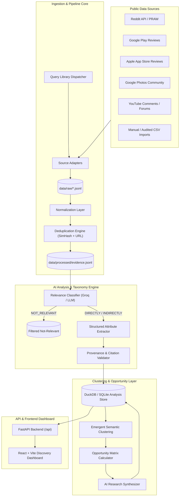
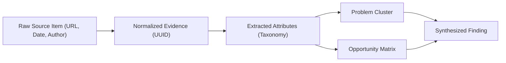
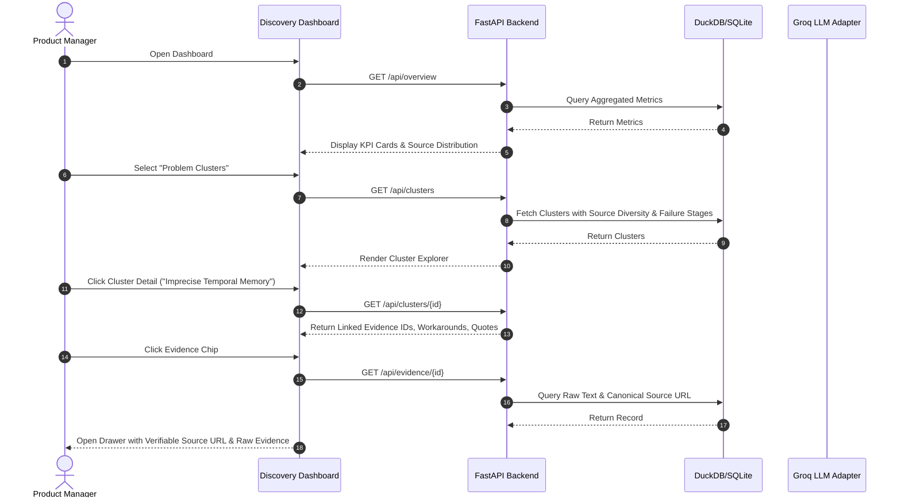
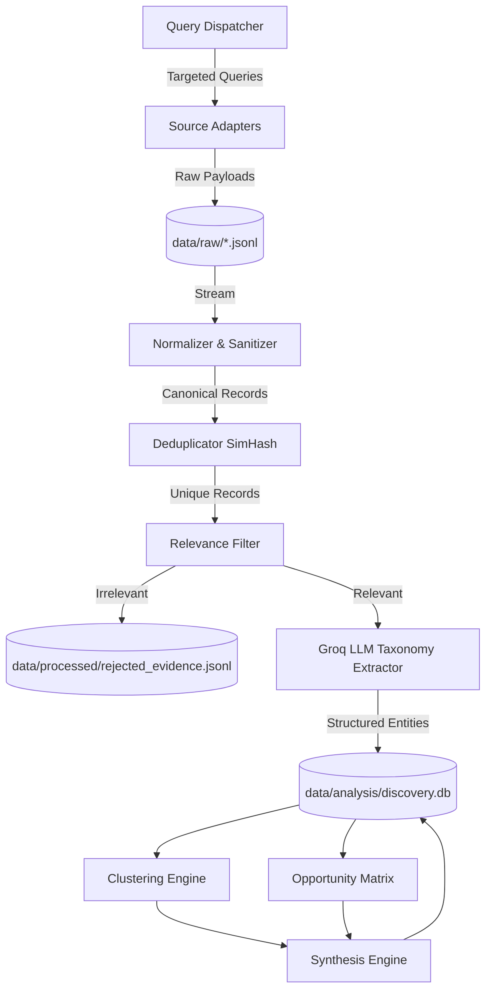

# Google Photos Discovery Engine — Architecture Specification

## 1. Architecture Goals
1. **Empirical Verifiability & Provenance**: Every finding, cluster, and synthesis must maintain an unbroken chain of custody down to the raw public record (source URL, author, timestamp, raw text).
2. **Modularity & Pluggability**: Source adapters, LLM inference provider (Groq), storage backends, and clusterers operate behind strict abstract interfaces.
3. **Resilience & Fault-Tolerance**: Gracefully handles rate limits, missing fields, schema changes, network timeouts, and malformed LLM outputs.
4. **Epistemic Integrity**: Enforces strict separation between raw facts, extracted attributes, AI inferences, and opportunity hypotheses. Zero tolerance for fabricated data.
5. **Lightweight & High-Velocity Deployment**: Built using a clean Python FastAPI backend with DuckDB/SQLite storage and a responsive modern React/Vite dashboard, avoiding distributed microservice complexity.

---

## 2. System Overview
The architecture is structured into 6 sequential core subsystems:
1. **Ingestion & Adapter Layer**: Dispatches multi-query search strategies to ingest real public discussions from Reddit, Google Play, App Store, Google Photos Community, forums, and YouTube.
2. **Normalization & Deduplication Engine**: Standardizes raw payloads into a unified evidence schema and eliminates cross-query/cross-source duplicates using URL hashing, title normalization, and fuzzy text hashing (SimHash/MinHash).
3. **AI Relevance Classification & Extraction Layer**: Filters out irrelevant noise (`NOT_RELEVANT`) and applies a multi-dimensional taxonomy extractor powered by **Groq** (`llama-3.3-70b-versatile`) to structured JSON attributes.
4. **Clustering & Opportunity Modeling Engine**: Discovers emergent retrieval problem clusters across behavioral vectors and evaluates them across a transparent multi-factor Opportunity Matrix.
5. **AI Synthesis & Provenance Verifier**: Produces evidence-grounded answers to the 8 core research findings using **Groq** (`llama-3.3-70b-versatile`), validates citations, and identifies contradictory evidence.
6. **API & Research Dashboard**: High-performance FastAPI REST endpoints serving an analytical, evidence-first React/Vite research interface.

---

## 3. Data Ingestion Layer
- **Orchestration**: The ingestion runner executes query families asynchronously per source.
- **Configurable Query Library**: Queries are grouped into thematic families:
  - *Symptom/Frustration*: `"can't find old photos"`, `"remember photo can't find"`, `"search doesn't work"`
  - *Contextual/Entity Search*: `"search people"`, `"search location"`, `"search date"`, `"find screenshot"`, `"find document"`
  - *Natural Language & Semantic*: `"search by description"`, `"relevant search results"`, `"Ask Photos"`
- **Polite Retrieval**: Implements polite request intervals, backoff, and user-agent declarations respecting `robots.txt` and developer terms.

---

## 4. Source Adapters
Each adapter inherits from `BaseSourceAdapter` and implements `fetch(query_library, time_window) -> List[RawRecord]`:
- **RedditAdapter**: Queries Reddit's search endpoint across targeted subreddits (`r/googlephotos`, `r/google`, `r/Android`, `r/techsupport`). Extracts selftext, title, score, comment threads, permalinks, and publication timestamps.
- **GooglePlayAdapter**: Uses `google-play-scraper` to pull verified reviews with star ratings, reviewer timestamps, and text.
- **AppStoreAdapter**: Uses `app-store-scraper` to fetch iOS user feedback on search, media syncing, and retrieval.
- **CommunitySupportAdapter**: Ingests public Google Photos Help Community threads, parsing opening problem descriptions, marked answers, and community workarounds.
- **ManualImportAdapter**: Ingests validated CSV/JSONL records from external tech forums, YouTube comments, or exported audit logs.

---

## 5. Normalization Layer
Converts raw heterogeneous responses into the strict canonical schema:
- Parses timestamps into standard ISO-8601 UTC.
- Canonicalizes URLs (strips tracking parameters, ref codes).
- Preserves raw untransformed text in `raw_text` for provenance auditing.
- Tags initial metadata (`source`, `country_or_region`, `rating`, `author`).

---

## 6. Relevance Classifier
Filters noise before costly extraction. Uses a fast Groq LLM pass (`llama-3.3-70b-versatile` via `GroqLLMAdapter`) with prompt-engineered structured classification:
- **DIRECTLY_RELEVANT**: User actively seeking, searching, or attempting to locate a known visual memory.
- **INDIRECTLY_RELEVANT**: Issue indirectly degrading retrieval efficacy (e.g., facial tag inaccuracies, album sorting chaos, metadata corruption, search index delay).
- **NOT_RELEVANT**: Completely unrelated to retrieval (e.g., photo editor crashing, subscription pricing complaints, device battery drain).
*Storage*: `NOT_RELEVANT` items are routed to `data/processed/rejected_evidence.jsonl` to ensure full auditability.

---

## 7. Evidence Extraction Layer
The Evidence Extraction Layer directly addresses Research Questions A–I by parsing relevant user evidence into structured behavioral taxonomy dimensions.

### Selected LLM Provider & Architecture
- **Selected Provider**: **Groq** is the selected LLM provider for AI-powered relevance classification and structured behavioral evidence extraction in this project (as well as subsequent research synthesis).
- **Decoupled Adapter Layer**: Groq is accessed strictly through the dedicated `GroqLLMAdapter` (`src/extraction/llm_adapter.py`). Higher-level ingestion pipelines, data models, and storage components interact only with standard abstract interfaces, ensuring the rest of the system remains completely provider-agnostic.
- **Environment Configuration**:
  - `GROQ_API_KEY`: Authentication secret loaded securely via `.env` at runtime (never hard-coded in source code or committed to version control).
  - `GROQ_MODEL`: Configurable model identifier (defaults to `llama-3.3-70b-versatile`, permitting model swaps via `.env` without altering application logic).
- **Local Clustering Separation**: Groq is utilized solely for natural language classification, entity extraction, and narrative synthesis. It is **not** used for clustering; clustering is executed locally using `scikit-learn` feature representations and HDBSCAN.
- **Resilience & Validation**:
  - Operates in strict JSON object mode (`response_format={"type": "json_object"}`).
  - Employs automated retries with exponential backoff (2s, 4s, 8s) upon encountering HTTP 429 (`RateLimitError`) or network timeouts (`APITimeoutError`).
  - Enforces Pydantic schema validation (`LLMExtractionResult`) with enum sanitization and confidence clamping before persisting to disk.

### Extracted Attributes
- `retrieval_object` (screenshot, personal photo, utility document, medicine, travel clip, etc.)
- `memory_cues` (temporal, spatial, person, visual appearance, activity, visible text, etc.)
- `missing_information` (forgot exact date, forgot location, forgot person name, etc.)
- `search_behavior` (keyword search, timeline scroll, folder browse, etc.)
- `search_formulation` (`original_query` preserved verbatim, `normalized_query`)
- `failure_stage` (one or more of the 10 standardized failure stages)
- `workaround` (external messaging search, asking others, endless scroll, etc.)
- `outcome` (`SUCCESSFUL_RETRIEVAL`, `PARTIAL_SUCCESS`, `FAILED_RETRIEVAL`, `ABANDONED`, `UNCLEAR`)
- `confidence` (0.0 – 1.0)

---

## 8. Deduplication Engine
Duplicate discussions frequently appear across forums or multi-keyword searches:
1. **URL Hash**: Exact canonical URL match.
2. **Title Normalization**: Lowercase, stripped punctuation, and Levenshtein distance check.
3. **Content MinHash / Cosine Similarity**: Near-duplicate detection for identical text posted across platforms. Duplicate instances append their source reference without double-counting evidence frequency.

---

## 9. Storage Architecture
- **Raw Layer (`data/raw/`)**: Source JSONL files partitioned by source and scrape date. Immutable audit log.
- **Processed Layer (`data/processed/`)**: Normalized, deduplicated, and LLM-classified evidence items.
- **Analysis Layer (`data/analysis/`)**: Structured analytical data stored in DuckDB / SQLite (`discovery.db`) with tables:
  - `evidence`: Full normalized records with extracted behavioral tags.
  - `clusters`: Emergent problem clusters and linked evidence IDs.
  - `opportunities`: Multidimensional opportunity scores and metrics.
  - `synthesis_findings`: The 8 synthesized core research findings with citations.
  - `audit_log`: Ingestion runs, timestamps, and error logs.

---

## 10. Clustering Engine
- Computes multidimensional feature representations for each relevant evidence item:
  - Vector embedding of retrieval scenario + failure description.
  - Categorical co-occurrence matrix (Memory Cue $\times$ Failure Stage $\times$ Retrieval Object).
- Employs HDBSCAN (natively available via `scikit-learn>=1.4.0` as `sklearn.cluster.HDBSCAN`) and Hierarchical Agglomerative Clustering to discover organic themes without pre-imposing rigid buckets.
- Generates cluster metadata: Cluster Name, Narrative Description, Affected Retrieval Stages, Typical Workarounds, Representative Evidence IDs, and Source Diversity Index.

---

## 11. Opportunity Analysis Matrix
Calculates seven distinct evidence dimensions per cluster (NO single arbitrary composite score):
1. **Evidence Volume ($N$)**: Total unique evidence records.
2. **Source Diversity ($D$)**: Unique platforms represented (e.g., 4/4 sources = 1.0).
3. **Recurrence Rate ($R$)**: Ratio of unique authors across distinct timeframes.
4. **Severity Index ($S$)**: Weighted rating based on emotional loss, critical utility (e.g., medical/legal docs vs. meme), and expressed user frustration.
5. **Retrieval Impact ($I$)**: Proportion of queries ending in complete failure or abandonment.
6. **Workaround Inefficiency ($W$)**: Friction level of compensatory behaviors.
7. **Evidence Confidence ($C$)**: Average model extraction confidence and source verification score.

---

## 12. AI Synthesis Engine
Synthesizes high-level product research findings answering the 8 prescribed questions using **Groq** via the `GroqLLMAdapter`:
- Answering Findings 1 through 8 strictly from extracted database records and local cluster metrics.
- Flags contradictory evidence explicitly (e.g., users for whom NLP queries succeeded vs. failed).
- Outputs concise PM-ready narratives linked directly to evidence IDs and source URLs.
- **Provider Consistency**: Shares the identical Groq LLM infrastructure (`GROQ_API_KEY`, `GROQ_MODEL=llama-3.3-70b-versatile`) as the extraction layer to guarantee consistent reasoning and unified token budgeting.

---

## 13. API Layer (FastAPI)
RESTful, documented endpoints:
- `GET /api/health`: System health and model availability.
- `GET /api/overview`: Aggregated stats (total records, relevant/irrelevant ratio, sources, date range).
- `GET /api/evidence`: Paginated, filterable evidence explorer (by source, stage, cue, outcome).
- `GET /api/evidence/{id}`: Detailed record view with full raw text, extraction tags, and provenance links.
- `GET /api/clusters`: Summary of all emergent problem clusters.
- `GET /api/clusters/{id}`: Cluster deep dive with member evidence and metrics.
- `GET /api/opportunities`: Comparative multidimensional opportunity matrix.
- `GET /api/findings`: The 8 structured research findings with citations and caveats.
- `POST /api/ingest`: Trigger on-demand ingestion run.
- `POST /api/analyze`: Trigger normalization, extraction, clustering, and synthesis pipeline.

---

## 14. Frontend Architecture
- **Tech Stack**: React 18 + Vite + Tailwind/Vanilla CSS + Lucide Icons + Recharts / Chart.js.
- **Design Philosophy**: Professional, high-density PM workbench. Dark-mode capable, information-dense, evidence-traceable.
- **Views**:
  - `Overview Dashboard`: High-level metrics, ingestion summary, platform breakdown.
  - `Evidence Explorer`: Searchable data table with side-drawer inspector and direct source URLs.
  - `Problem Clusters`: Interactive cluster cards with drill-down into failure stages.
  - `Opportunity Matrix`: Comparative multi-attribute bubble/bar matrix view (no forced rankings).
  - `AI Synthesis & Findings`: Narrative insights with inline expandable evidence chips.
  - `Research Methodology & Quality`: Data provenance, limitations, and conflict audits.

---

## 15. Logging, Security & Compliance
- **Logging**: Structured logging using standard library `logging` module tracking query dispatches, parsing errors, token usage, and pipeline milestones without external dependencies.
- **Security & Privacy**: Redacts personally identifiable phone numbers, email addresses, and private names in raw reviews where applicable. Zero credential leakage via `.env`.
- **Compliance**: Respects API rate limits and robots.txt; ingests strictly public data.

---

## 16. Rate Limiting & Failure Handling
- **API Throttling**: Exponential backoff and jitter algorithms on all network requests.
- **LLM Token Management**: Batch queuing with chunked requests to prevent Groq TPM/RPM limit exhaustion.
- **Graceful Degradation**: If an optional external adapter fails (e.g., API key missing), the engine flags the source as disabled and processes remaining sources cleanly.

---

## 17. Data Provenance Architecture
Every analytical statement in the system is rooted in a traceable DAG:

---

## 18. User Interaction Flow

---

## 19. Data Flow Architecture

---

## 20. Deployment Architecture
- **Local Research Mode (Primary)**:
  - Backend: `uvicorn src.api.main:app --port 8000 --reload`
  - Frontend: `npm run dev` running on `localhost:5173`
  - Database: Local embedded DuckDB / SQLite file (`data/analysis/discovery.db`).
- **Reproducibility Container**: Optional lightweight `docker-compose.yml` bundling FastAPI and the static-built Vite SPA.
